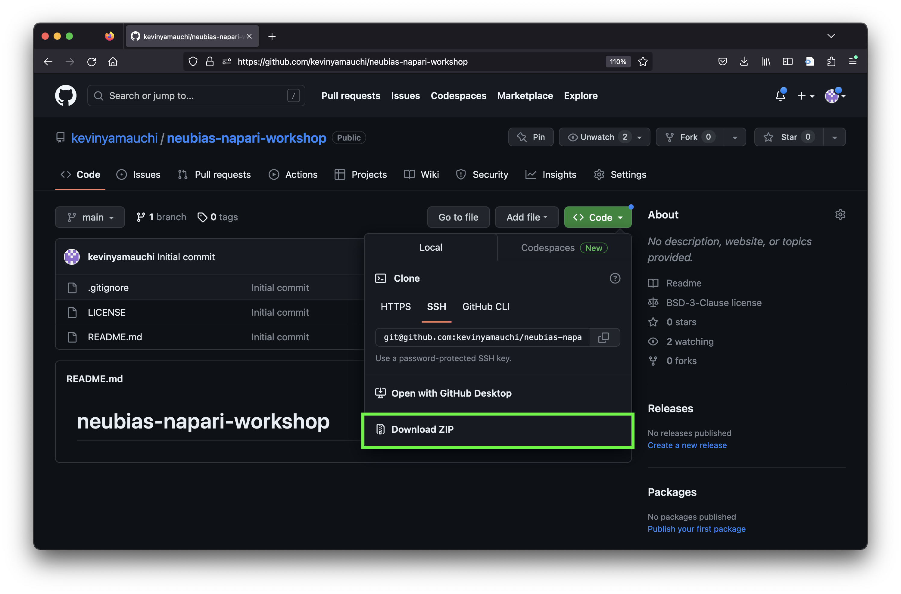
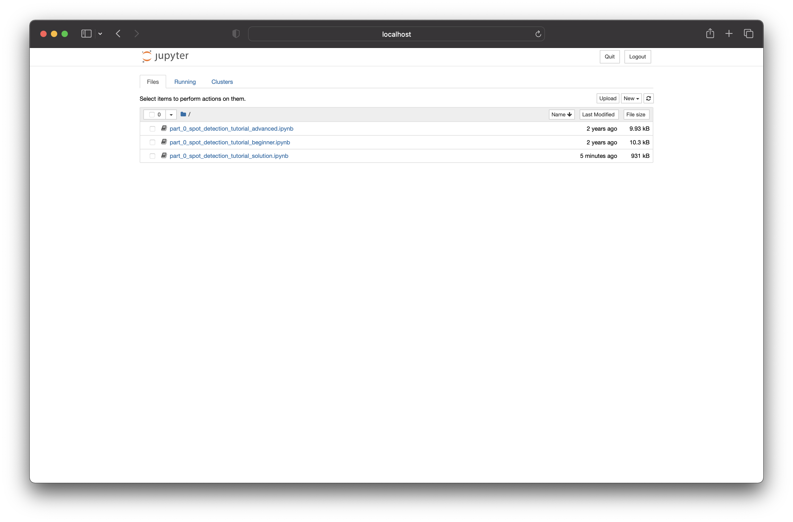

# Downloading and launching the notebooks

## Downloading the notebooks.
During this tutorial, we will be working through a set of notebooks. On this page, we will download the notebooks and launch jupyter notebook. There are two ways to download the notebooks: download as a .zip from github. Follow the instructions below for either "downloading zip" (recommended for beginners) or "cloning via git".

### Downloading .zip
You can download the notebooks as a .zip file. To do so, please do the following:

1. Navigate your web browser to: [https://github.com/kevinyamauchi/neubias-napari-workshop](https://github.com/kevinyamauchi/neubias-napari-workshop)
2. Click the green "Code" button to open the download menu and then "Download ZIP"
    
3. Choose the location you would like to download the .zip.
4. Open your file browser and double click on the .zip file to uncompress it.
5. You have downloaded the notebooks! Proceed to the "Launching jupyter notebook" section.


### Cloning via git
You can use git to clone the repository containing the tutorial materials to your computer. We recommend cloning the materials into your Documents folder, but you can choose another suitable location. First, open your Terminal navigate to you the folder you will download the course materials into

```bash
cd ~/Documents
```

and then clone the repository. This will download all of the files necessary for this tutorial.

```bash
git clone https://github.com/kevinyamauchi/neubias-napari-workshop.git
```

## Launch jupyter notebook

Open your terminal and navigate to the `notebooks` subdirectory of the `embl-napari-workshop` directory you just downloaded.

```
cd <path to neubias-napari-tutorial>/notebooks
```

Now activate your `napari-tutorial` conda environment you created in the installation step.

```
conda activate napari-tutorial
```

We will perform the analysis using Jupyter Notebook. To start Jupyter Notebook, enter

```bash
jupyter notebook
```

Jupyter Notebook will open in a browser window and you will see the following notebooks:

- `part_0_spot_detection_tutorial_<beginner, advanced, solution>.ipynb`: in this notebook you will write a custom function to perform spot detection.


